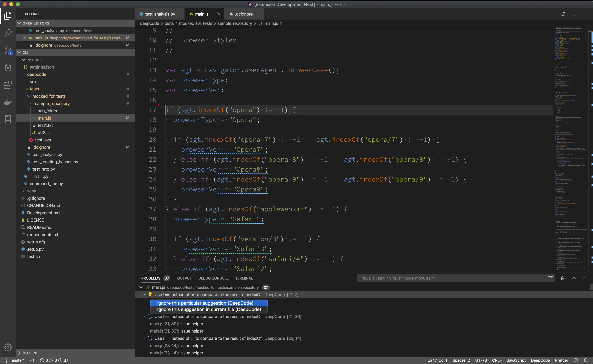

**The Visual Studio Code extension provided by <a href="https://www.deepcode.ai/">DeepCode.ai</a> finds bugs and critical vulnerabilities in your code. We support Java, Python, JavaScript, TypeScript and XML.**

# Table of Contents

1. [DeepCode extension - what is it?](#deepcode-extension)
2. [Installation](#installation)
   1. [Video on how to install the extension](#video-on-how-to-install-the-extension)
   2. [Tips on the installation process](#tips-on-the-installation-process)
3. [How to use it?](#how-to-use-it)
   1. [PROTIP: DeepCode analysis on Save](#protip---deepcode-analysis-on-save)
   2. [Video on how to use the extension](#video-on-how-to-use-the-extension)
   3. [DeepCode in action](#deepcode-in-action)
   4. [How to ignore suggestions (text)](#how-to-ignore-suggestions-text)
   5. [How to ignore suggestions (video)](#how-to-ignore-suggestions-video)
   6. [.dcignore file](#dcignore-file)
4. [Feedback and contact](#feedback-and-contact)

# DeepCode extension

Through the extension you can quickly start using DeepCode's code review and analysis within your development workflow. The extension will automatically alert you about critical vulnerabilities you need to solve in your code the moment when you hit Save in your IDE. With DeepCode's superior code review you save time finding and fixing bugs before they go to production. 

## DeepCode's AI Engine finds bugs

DeepCode uses symbolic AI to process hundreds of millions of commits in open source software projects and learns how to find serious coding issues. Because the platform determines the intent of the code — and not only the syntax mistakes — DeepCode identifies 10x more critical bugs and security vulnerabilities than other tools. 

## Our AI provides explanation behind found bugs

In order to show detailed explanation why something was flagged as bug we introduced a new AI technique called Ontology. With Ontology, we’ve integrated the capability to present logical conclusions within the DeepCode engine. 

## Supported languages

Java, JavaScript, Python, TypeScript and XML are currently supported. C/C++ support is coming soon.

# Installation

## Video on how to install the extension

- We've prepared a short video on how to install the extension. Head over to youtube to quickly get the extension up and running:

  

## Tips on the installation process

- select **"Cloud"** when you want to use your (cloud) Github, BitBucket or Gitlab account.
- select **"Self-managed"** when the organization you are part of has a DeepCode Server installation. The DeepCode service is likely running in combination with self-managed BitBucket or Gitlab.

# How to use it?

## PROTIP - DeepCode analysis on Save

- DeepCode's extension runs automatically when you hit Save (or the keyboard shortcut).
- If you don't like to save while working we strongly recommend to [enable the AutoSave](https://code.visualstudio.com/docs/editor/codebasics#_save-auto-save).

## Video on how to use the extension

- Here is a video on how to use the extension. In short - don't forget to save and you would be in good hands:

## DeepCode in action 

- Here is how it looks like when inspecting all issues using the "Problems" tab and syntax highlight:

## How to ignore suggestions (text)

There are two key steps here:
    
   1. Ignore particular alert directly within its suggestions tooltip or 'bulb' menu:

   

   2. Deepcode will create a comment, that will inform our analysis engine to ignore it. Don't forget to specify a description why you think it needs to be ignored. Your feedback will improve our engine over time:

   

## How to ignore suggestions (video)

- If the above information is not enough and want to see it in action, here is a video:

## .dcignore file 

- If you want to ignore certain files/folders (like node_modules for example), create a .dcignore file. You can create it in any folder on any level starting from the directory where your project resides. The file syntax is identical to .gitignore:

# Feedback and contact

- In case you need to contact us or provide feedback, we would love to hear from you - [here is how to get in touch with us](https://www.deepcode.ai/feedback).
- If you need to update this file, you can do so by [editing this README.md](https://github.com/DeepCodeAI/vscode-extension/edit/master/README.md).
